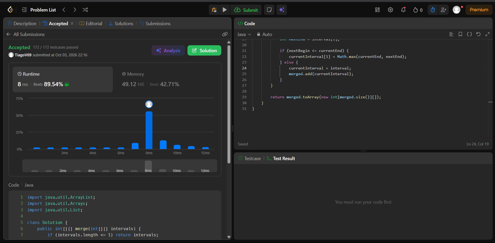
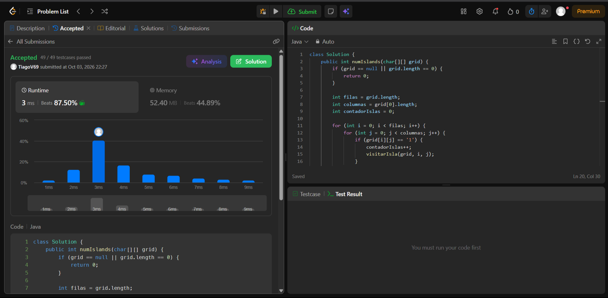
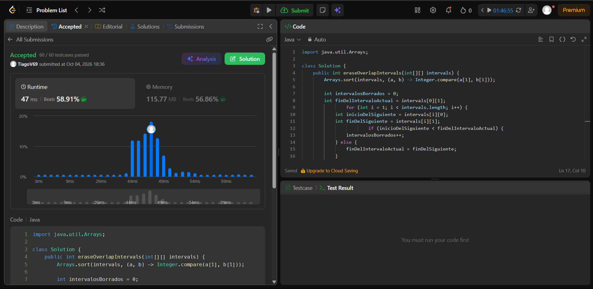
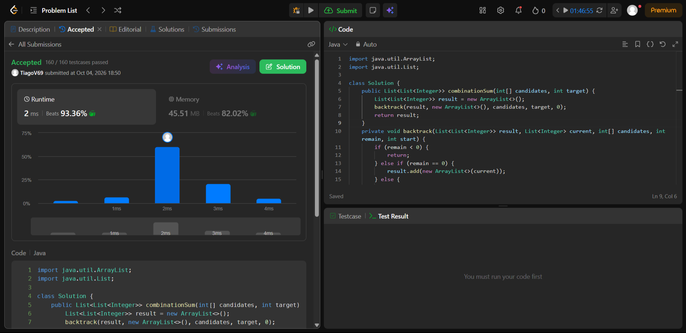

# Taller - Análisis de Algoritmos

## 56. Merge Intervals

- **Enlace:** [Merge Intervals](https://leetcode.com/problems/merge-intervals/)
- **Familia:** Ordenamiento
- **Idea:** Se ordenan los intervalos tomando como clave su extremo izquierdo (`start`). Luego se recorren de izquierda a derecha; si el intervalo actual empieza antes o justo cuando termina el anterior, se fusionan ensanchando el extremo derecho (`end`). Si no se solapan, se cierra el actual y se agrega como uno nuevo.
- **Complejidad:** Tiempo `O(n log n)` dominado por el algoritmo de ordenamiento inicial. Espacio `O(n)` en el peor de los casos para almacenar la nueva lista de intervalos fusionados.

---

## 200. Number of Islands

- **Enlace:** [Number of Islands](https://leetcode.com/problems/number-of-islands/)
- **Familia:** Grafos
- **Idea:** El grafo es implícito, donde cada celda `'1'` es un vértice conectado ortogonalmente. Se recorre la matriz y cada vez que aparece un `'1'` no visitado, se suma una isla y se lanza un DFS (o BFS) para hundir (`'0'`) o marcar toda esa componente conexa, evitando contarla dos veces.
- **Complejidad:** Tiempo `O(m * n)`, donde `m` son las filas y `n` las columnas, ya que en el peor caso se visita cada celda de la grilla. Espacio `O(m * n)` en el peor caso debido a la memoria utilizada por la pila de recursión del DFS si toda la grilla es tierra.

---

## 1143. Longest Common Subsequence

- **Enlace:** [Longest Common Subsequence](https://leetcode.com/problems/longest-common-subsequence/)
- **Familia:** Programación dinámica
- **Idea:** Se utiliza una matriz donde el estado `dp[i][j]` representa el LCS de los prefijos de tamaño `i` y `j`. Si los caracteres coinciden, la longitud es `1 + dp[i-1][j-1]`. Si no coinciden, se toma el máximo entre ignorar un carácter del primer texto o del segundo: `max(dp[i-1][j], dp[i][j-1])`.
- **Complejidad:** Tiempo `O(n * m)`, siendo `n` y `m` las longitudes de las cadenas de texto a comparar, pues hay que llenar la tabla. Espacio `O(n * m)` para almacenar la matriz de memorización completa.

---

## 435. Non-overlapping Intervals

- **Enlace:** [Non-overlapping Intervals](https://leetcode.com/problems/non-overlapping-intervals/)
- **Familia:** Greedy
- **Idea:** Se ordenan los intervalos por su tiempo de finalización (`end`). El criterio local óptimo es ir eligiendo el siguiente intervalo que no se solape con el último aceptado (que empiece igual o después); lo que no se elige, se ignora y se cuenta como "borrado".
- **Complejidad:** Tiempo `O(n log n)` necesario para el ordenamiento inicial. Espacio `O(log n)` o `O(n)` de memoria adicional, dependiendo de la implementación del sort en el lenguaje de programación.

---

## 39. Combination Sum

- **Enlace:** [Combination Sum](https://leetcode.com/problems/combination-sum/)
- **Familia:** Backtracking
- **Idea:** Se elige un candidato, se resta su valor al `target` y se avanza de forma recursiva reutilizando el mismo índice para permitir repeticiones. Si la suma supera el objetivo, se poda la rama; si lo iguala, se copia la combinación al resultado. Al regresar de la recursión, se deshace la última elección (backtrack).
- **Complejidad:** Tiempo `O(N^(T/M))`, donde `N` es la cantidad de candidatos, `T` es el target y `M` es el valor mínimo entre los candidatos (altura máxima del árbol de decisión). Espacio `O(T/M)` correspondiente a la máxima profundidad de la pila de recursión.

