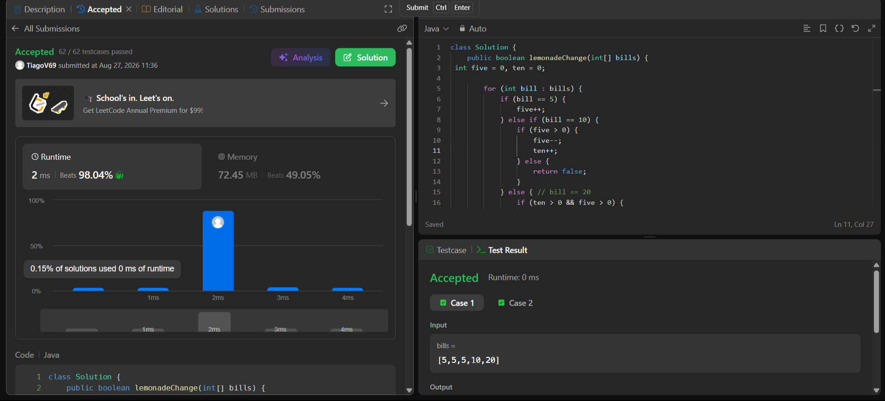
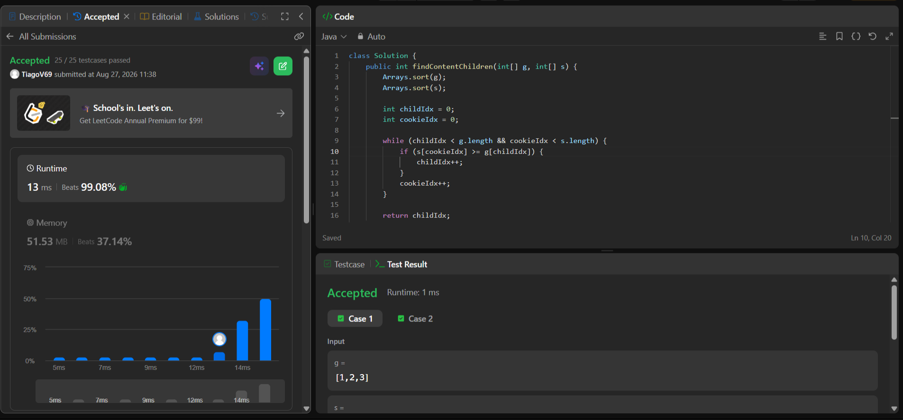

# Tarea 1 - Algoritmos Greedy en LeetCode

**Curso:** Analisis de Algoritmos
**Institucion:** ITM
**Semestre:** 2026-2

---

## 1. Ejercicio 860: Lemonade Change

* **Enlace:** [860. Lemonade Change](https://leetcode.com/problems/lemonade-change/)
* **Criterio Greedy:** Para un billete de 20, se prioriza dar 10 + 5 en vez de tres billetes de 5. Asi se conservan los billetes de 5 para futuros cambios.
* **Complejidad de tiempo:** $O(N)$, se recorre el arreglo una sola vez.
* **Complejidad de espacio:** $O(1)$, solo se usan los contadores 'five' y 'ten'.

### Evidencia de Aceptacion

---

## 2. Ejercicio 455: Assign Cookies

* **Enlace:** [455. Assign Cookies](https://leetcode.com/problems/assign-cookies/)
* **Criterio Greedy:** Se ordenan los factores de gula `g` y los tamaños `s`. Se asigna la galleta mas pequena que pueda satisfacer al niño con menor gula. Si no alcanza, esa galleta tampoco servira para los siguientes.
* **Complejidad de tiempo:** $O(N \log N + M \log M)$ por el ordenamiento. El recorrido con dos punteros es $O(N + M)$.
* **Complejidad de espacio:** $O(1)$ de espacio adicional, sin contar la memoria usada por el algoritmo de ordenamiento.

### Evidencia de Aceptacion

